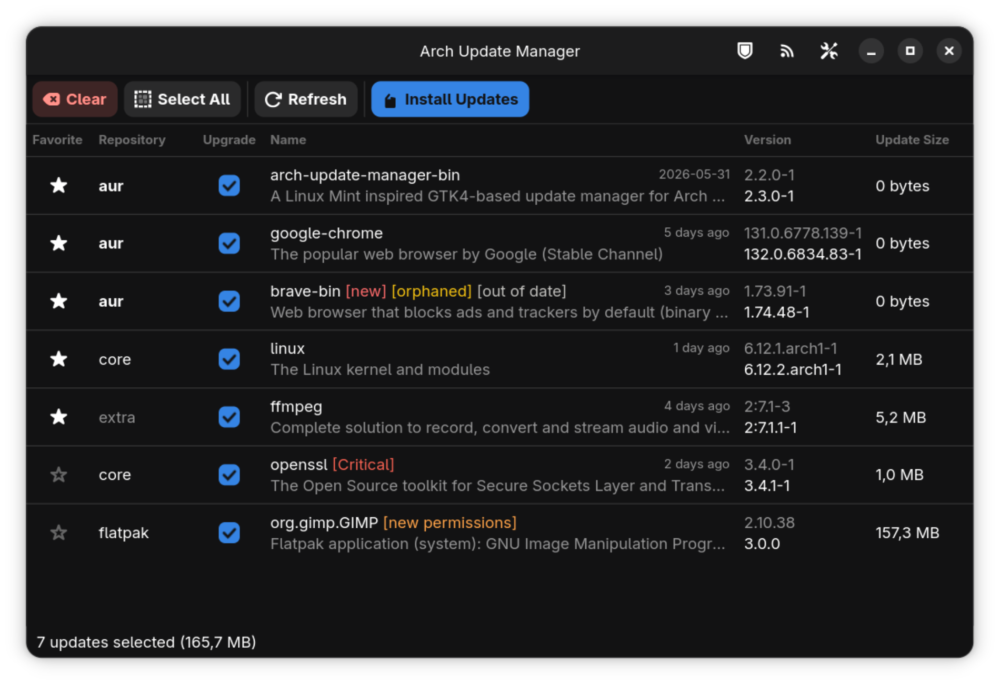

# Arch Install Manager

Arch Install Manager (daim) is an app for Arch Linux that helps you install, update and manage your software. It gives you a simple window, much like the Software Manager in Linux Mint. It also comes with a terminal command that does the same things.



## What you can do

- Install apps from the official Arch repositories, the AUR and Flatpak.
- Update everything you have, including AUR apps, Flatpak apps and AppImages.
- Remove apps, roll one back to an older version and clean up leftover files.
- Mark apps as favorites, hide the ones you do not want and sort them your way.
- Make a backup snapshot with Timeshift or Snapper before you update.
- Get a tray icon that tells you when updates are ready.
- Move an app from the AUR to an official repository once it is available there.
- See a few helpful follow up steps after an update, such as services that need a restart.

The app asks for your password only when it needs it. It only asks once. When it builds an app from the AUR, it first shows you the build recipe so you can look it over. Those builds always run as you, never with admin rights.

## Install

Build and install it from source.

```bash
makepkg -si
```

Or install it from the AUR with the helper you already use.

```bash
paru arch-install-manager
```

There are three versions to pick from.

- arch-install-manager builds from the latest stable release.
- arch-install-manager-bin installs a ready made build of that release.
- arch-install-manager-git builds from the newest code.

## License

This project uses the MIT License.
